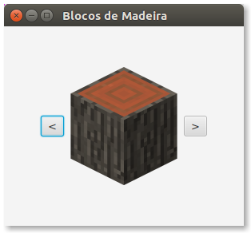

# Prática: Interfaces Gráficas com JavaFX


## Preparação


1. Para estes exercícios, é necessário ter instalado o JDK 8 (Java Standard Ediction Development Kit 8), ou versões superiores.

2. Estes exercícios tratam de **interfaces gráficas** em Java, usando o toolkit JavaFX. Para isso, é necessário entender os recursos de **orientação a objetos** estudados até então (herança, polimorfismo, interfaces, etc.). 

3. Veja mais sobre interfaces gráficas em JavaFX nos [slides](https://docs.google.com/presentation/d/1nwcBZscvpQDCY7xux7FaKWrSzn8VTJDKpm7mI5uoLJg/edit?usp=sharing) da disciplina e na [documentação da Oracle](https://docs.oracle.com/javafx/2/) sobre JavaFX.


## Exercícios

1. Baixe o programa [HelloButtonLabel.java](src/HelloButtonLabel.java). Compile-o e execute-o usando seu IDE preferido, ou faça isso diretamente num terminal:
   ```

   ```

2. Usando como referência o exemplo acima e o programa [HelloImage.java](src/HelloImage.java), você deverá construir um programa para visualizar 6 tipos de blocos de Madeira do jogo Minecraft, um de cada vez. A interface do programa deverá ter botões para avançar e retroceder a visualização da lista de blocos, conforme o exemplo ao lado.




**Observação**: os programas de exemplo usam as classes `VBox` e `StackPane` para o layout dos objetos na interface gráfica. Para este exercício, você deverá usar outra classe de layout. Para saber mais sobre layouts em JavaFX, veja este [tutorial da Oracle](https://docs.oracle.com/javafx/2/layout/builtin_layouts.htm).
